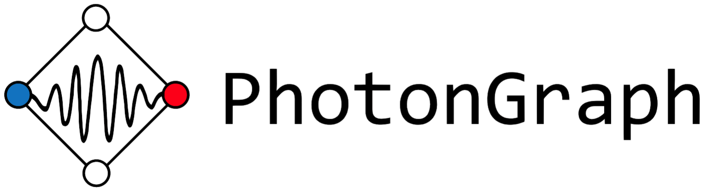

===========
PhotonGraph
===========

A Python module built on the shoulders of giants to serve as a toolkit for photonic graph state exploration, simulation and experimentation.

Description
===========

A longer description of the project will be written here...

